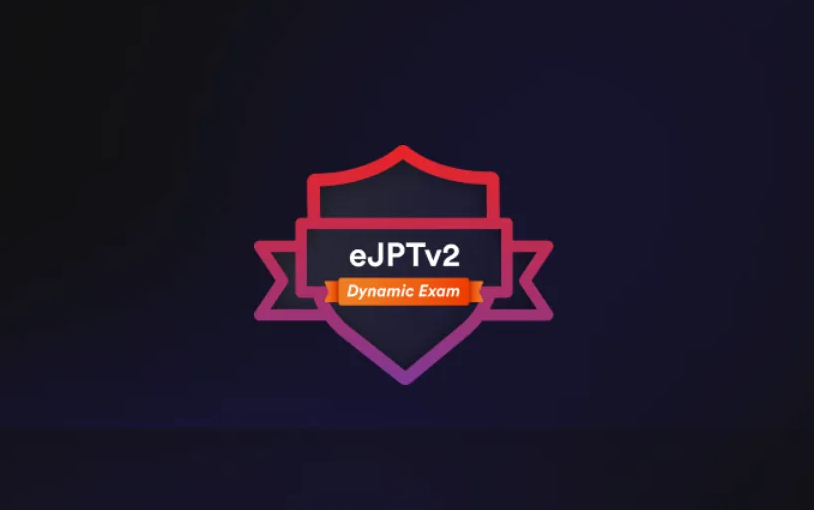

# 🔗 eJPTv2-notes

<figure><figcaption></figcaption></figure>

It's my eJPTv2 personal note-taking, based on INE PTSv2 course, and some resources I used to gain extra information to fully understand the subject and the technology behind it!

