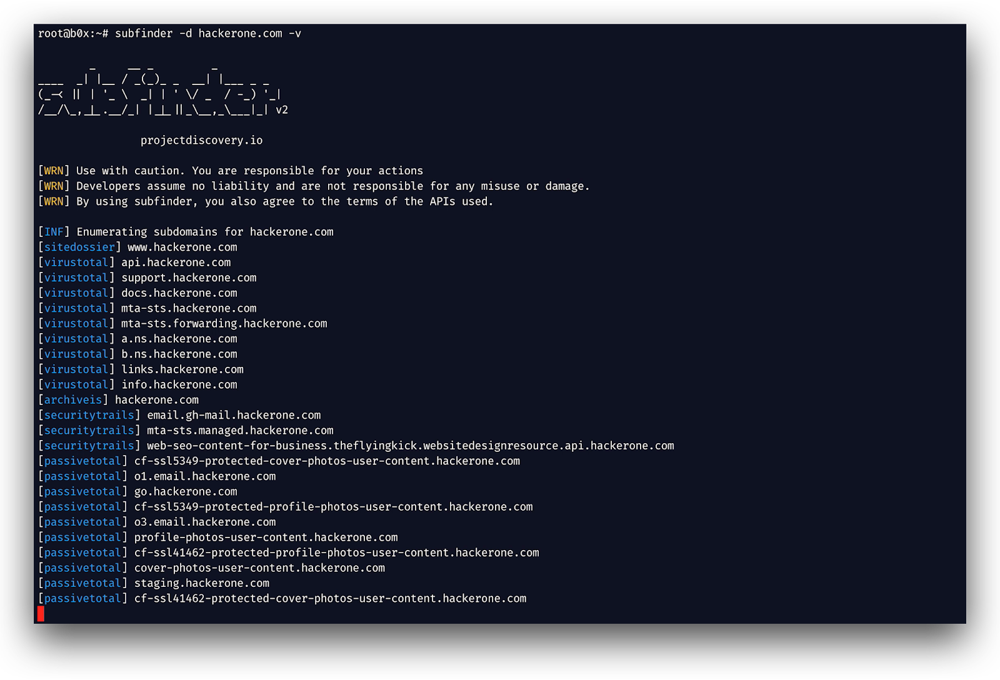

# Passive Reconnaissance

### Passive Reconnaissance

In this process, you will not be directly connected to a computer system. This process is used to gather essential information without ever interacting with the target systems.

### Website Recon & Footprinting
 
<h5>

\
Tools and websites  **:** 
| Tool & Website  | Used for |        usage        |
| :---:| :---: |:---:|
|**host** |  DNS Lookup utility |                 host \<url>     |
|     **robots.txt**           |       Search Engine Crawl        |  https://\<url>/robots.txt           |
|   **sitemaps.xml**            |     xml file to list website contents          |     https://\<url>/sitemap.xml        |
|         **builtwith**                |       Web technologies Recon    |      install in firefox \[[link](https://addons.mozilla.org/en-US/firefox/addon/builtwith/)\]            |
|           **wappalyzer**             |       Web technologies Recon    |   install in firefox \[[link](https://addons.mozilla.org/en-US/firefox/addon/builtwith/)\]              |
|                 **whatweb**       |       Web technologies Recon     |     whatweb \<<mark style="color:red;">url</mark>\>             |
|              **httrack**          |        Website copier   |     website <[how to start](https://www.httrack.com/html/step.html)>            |
|                 **Reverse DNS**       |      Reverse IP address to DNS     |     website [[link](https://mxtoolbox.com/ReverseLookup.aspx)]             |
|         **Whois**               |     Website Recon          |       **whois** \<url>  - website \[[link](https://www.whois.com)]            |
|      **Netcraft**                |    Website Recon          |          website \[[link](https:\/\/www.netcraft.com/)\]     |
|        **DNSdumpster**          |    Website Recon         |       dnsdumpster -d <url> - website \[[link](https:\/\/dnsdumpster.com/)\]            |
|        **Sublist3r**            |    Subdomain Recon  |  sublist3r -d \<url>     |                                                                          |
|           **wafw00f**           |    Website Application Firewall Recon       |          wafw00f  \<url> -a or --findall          |
|      **SubFinder**              |   Subdomain Recon        |                                           subfinder -d <url>                                                            |
|          **AMASS**              |       Website & Subdomain Recon    |         Massive Tool Tutorial    \[[link](https://github.com/owasp-amass/amass/blob/master/doc/tutorial.md)\]                                             
|           **SubBrute**          |     Subdomain & DNS      |                  python3 subbrute.py <URL> -o <OUTPUT NAME>                                                                                                         |
|         **Knock**               |     Subdomain Recon      |                   python3  knockpy.py <URL>
|        **AltDNS**               |    Subdomain Recon       |                    altdns -i <subdomains.txt> -o data_output -w words.txt -r -s results_output.txt      |                                                          
|        **Haktrails**            |    Website & Subdomain Recon       |                 cat domains.txt \| haktrails subdomains |
                                                                                                              

#### Website footprinting tools

Netcraft

> **Netcraft** - provides internet security services for a large number of use cases, including cybercrime detection and disruption, application testing and PCI scanning.
 

***

> **DNSdumpster**:  is an online passive scanning tool to obtain information about domains, block addresses, emails, and all kind of information DNS related.
>
> \
> **Tool** :&#x20;

***

> **Website :**&#x20;

**Whois** :\
is used to identifies who owns a domain and collect information about them like emails, addresses, especially if there don't activate the privacy protection&#x20;

**website** :&#x20;

.png>)\
\
**tool** : \
\
.png>)\

**WAF With wafw00f**&#x20;

* Check firewall behind the website! it can detect multiple firewall, very useful before using any scanning or foot printing tool\
  \
  

***

\
**SubFinder** :

is a subdomain discovery tool that returns valid subdomains for websites, using passive online sources. It has a simple, modular architecture and is optimized for speed. `subfinder` is built for doing one thing only - passive subdomain enumeration, and it does that very well.\
\
\

**Sublist3r**\
is a python tool designed to enumerate subdomains of websites using OSINT. It helps penetration testers and bug hunters collect and gather subdomains for the domain they are targeting. Sublist3r enumerates subdomains using many search engines such as Google, Yahoo, Bing, Baidu and Ask. Sublist3r also enumerates subdomains using Netcraft, Virustotal, ThreatCrowd, DNSdumpster and ReverseDNS.\
\
\
 (1).png>)

***

**Google Dorks**

> > Search Operators and Commands

* **site**:ine.com # specfic a domain
* **inurl**:admin # search specfic keyword in url
* **site**:\*.ine.com # search for subdomains
* **intitle**: admin # search intitle "index of" < show index files
* **filetype**:pdf # search by filetype
* Hacking with Google Dorks https://www.exploit-db.com/google-hacking-database

***

> **WayBackMachine**:  what is the Wayback Machine? The Internet Archive Wayback Machine is a service that allows people to visit archived versions of Web sites
>
> >

***

#### Email Harvesting

> **theHarvester** : a tool for gathering subdomain names, e-mail addresses, virtual hosts, open ports/ banners, and employee names from different public sources
>
> >

***

> **Spyse**_:_ is a search engine which can be used to identify internet assets and perform external reconnaissance easily.\
> \
> .png>)

***

#### Leaked Password Databases

> **haveibeenpwned?**  :  allows you to search across multiple data breaches to see if your email address or phone number has been compromised.
>
> > 

>
>
> **DeHashed** : is a hacked-database search-engine created for Security Analysts, Journalists, Security Companies, and everyday people to help secure accounts and provide insight on database breaches and account leaks. Protect yourself before it's too late, don't wait until you're hacked.
>
> **What can I search for?**
>
> Anything! Our advanced systems allow you to search for I.P. Addresses, Emails, Usernames, Names, Phone Numbers, VIN Numbers, Addresses; and what makes us even more unique, we allow you to reverse search Passwords, Hashes, and more!
>
> **How can I protect myself or remove my data?**
>
> Simply contact us and we will remove your data. However, removing your data from our search engine will not remove it from others. Your data will still be public, So you must change your passwords!
>
> > .png>)
