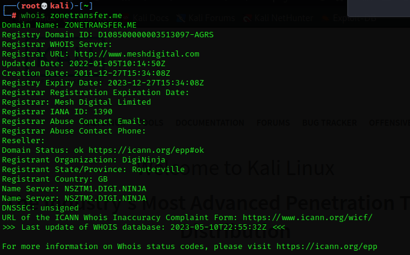

# Passive Reconnaissance

### Passive Reconnaissance

In this process, you will not be directly connected to a computer system. This process is used to gather essential information without ever interacting with the target systems.\

#### Website Recon & Footprinting

#### &#x20;Tools and websites  **:**

*   <mark style="color:green;">host</mark> : kali tool DNS lookup utility

    \
    `usage:`` `<mark style="color:green;">`host`</mark>` ``<`<mark style="color:red;">`url`</mark>`>`\

*   <mark style="color:green;">robots.txt</mark> : Search Engine Crawl\

    `usage : https://<`<mark style="color:red;">`url`</mark>`>/`<mark style="color:green;">`robots.txt`</mark>\

* <mark style="color:green;">sitemaps.xml</mark> : is xml file to list website contents\
  \
  `usage : https://<`<mark style="color:red;">`url`</mark>`>/`<mark style="color:green;">`robots.txt`</mark>\

* <mark style="color:green;">builtwith</mark> : addons to identify different web technologies \
  \
  `usage :  install in firefox [`[`link`](https://addons.mozilla.org/en-US/firefox/addon/builtwith/)`]` \

* <mark style="color:green;">wappalyzer</mark> : addons to identify different web technologies \
  \
  `usage :  install in firefox [`[`link`](https://addons.mozilla.org/en-US/firefox/addon/wappalyzer/)`]` \

* <mark style="color:green;">whatweb</mark> : kali tool that is used to identify different web technologies \
  \
  `usage :`` `<mark style="color:green;">`whatweb`</mark>` ``<`<mark style="color:red;">`url`</mark>`>` \

* <mark style="color:green;">httrack</mark> : website copier ( to copy whole or page of a website ) \
  \
  `usage :`` `<mark style="color:green;">`download and install`</mark> \

* <mark style="color:green;">Reverse DNS</mark> - reverse IP address to DNS \
  \
  `usage :``  `<mark style="color:red;">`website`</mark>` ``[`[`link`](https://mxtoolbox.com/ReverseLookup.aspx)`]`\

* <mark style="color:green;">Whois</mark> - website recon \
  \
  &#x20;`usage :`` `<mark style="color:green;">**`whois`**</mark>` ``<`<mark style="color:red;">`url`</mark>`>  ||`` `<mark style="color:red;">`website`</mark>` ``[`[`link`](https://www.whois.com)`]` \

* Netcraft -  is tool to scan websites. \
  \
  `usage :``  `<mark style="color:red;">`website`</mark>` ``[`[`link`](https://www.netcraft.com/)`]`\

* DNSdumpster - is website and tool for dns recon\
  \
  &#x20;`usage :`` `<mark style="color:green;">`dnsdumpster`</mark>` ``-d <`<mark style="color:red;">`url`</mark>`>  ||`` `<mark style="color:red;">`website`</mark>` ``[`[`link`](https://dnsdumpster.com/)`]` \
  &#x20;
* <mark style="color:green;">Sublist3r</mark> - subdomain recon tool \
  \
  `usage :`` `<mark style="color:green;">`sublist3r`</mark>` ``-d <`<mark style="color:red;">`url`</mark>`>` \

* <mark style="color:green;">wafw00f</mark> - is website application firewall\
  \
  `usage :`` `<mark style="color:green;">`wafw00f`</mark>`  ``<`<mark style="color:red;">`url`</mark>`>`\
  \
  `-a or --findall # test all firewall applications` &#x20;
* <mark style="color:green;">SubFinder</mark> - subdomain recon tool \

*   AMASS\

*   SubBrute

*   Knock

*   AltDNS

*   Axiom

* Haktrails

#### Website Footprinting With Netcraft

> <mark style="color:red;">**Netcraft**</mark> - provides internet security services for a large number of use cases, including cybercrime detection and disruption, application testing and PCI scanning.
>
> > 

***

#### Website Footprinting

> <mark style="color:green;">DNSdumpster</mark>:  is an online passive scanning tool to obtain information about domains, block addresses, emails, and all kind of information DNS related.

***

> <mark style="color:red;">DNSDumpster :</mark>&#x20;

### <mark style="color:green;">Whois :</mark>

#### &#x20;is used to identifies who owns a domain and collect information about them like emails, addresses, especially if there don't activate the privacy protection&#x20;

website :&#x20;

.png>)\
\
tool : \
\
.png>)\

### WAF With <mark style="color:green;">wafw00f</mark>&#x20;

* Check firewall behind the website! it can detect multiple firewall, very useful before using any scanning or foot printing tool
* |\
  \
  

***

## Subdomain Enumeration

### <mark style="color:green;">SubFinder</mark>

is a subdomain discovery tool that returns valid subdomains for websites, using passive online sources. It has a simple, modular architecture and is optimized for speed. `subfinder` is built for doing one thing only - passive subdomain enumeration, and it does that very well.\
\
\

### <mark style="color:green;">Sublist3r</mark>

\
is a python tool designed to enumerate subdomains of websites using OSINT. It helps penetration testers and bug hunters collect and gather subdomains for the domain they are targeting. Sublist3r enumerates subdomains using many search engines such as Google, Yahoo, Bing, Baidu and Ask. Sublist3r also enumerates subdomains using Netcraft, Virustotal, ThreatCrowd, DNSdumpster and ReverseDNS.\
\
\
 (1).png>)

***

#### Google Dorks

> > Search Operators and Commands

* site:ine.com # specfic a domain
* inurl:admin # search specfic keyword in url
* site:\*.ine.com # search for subdomains
* intitle: admin # search intitle "index of" < show index files
* filetype:pdf # search by filetype
* Hacking with Google Dorks https://www.exploit-db.com/google-hacking-database

***

> <mark style="color:red;">**WayBackMachine**</mark>:  what is the Wayback Machine? The Internet Archive Wayback Machine is a service that allows people to visit archived versions of Web sites
>
> >

***

#### Email Harvesting

> <mark style="color:green;">**theHarvester**</mark> : a tool for gathering subdomain names, e-mail addresses, virtual hosts, open ports/ banners, and employee names from different public sources
>
> >

***

> <mark style="color:red;">**Spyse**</mark>_:_ is a search engine which can be used to identify internet assets and perform external reconnaissance easily.\
> \
> .png>)

***

#### Leaked Password Databases

> <mark style="color:red;">haveibeenpwned?</mark>  :  allows you to search across multiple data breaches to see if your email address or phone number has been compromised.
>
> > 

>
>
> <mark style="color:red;">DeHashed</mark> : is a hacked-database search-engine created for Security Analysts, Journalists, Security Companies, and everyday people to help secure accounts and provide insight on database breaches and account leaks. Protect yourself before it's too late, don't wait until you're hacked.
>
> **What can I search for?**
>
> Anything! Our advanced systems allow you to search for I.P. Addresses, Emails, Usernames, Names, Phone Numbers, VIN Numbers, Addresses; and what makes us even more unique, we allow you to reverse search Passwords, Hashes, and more!
>
> **How can I protect myself or remove my data?**
>
> Simply contact us and we will remove your data. However, removing your data from our search engine will not remove it from others. Your data will still be public, So you must change your passwords!
>
> > .png>)
